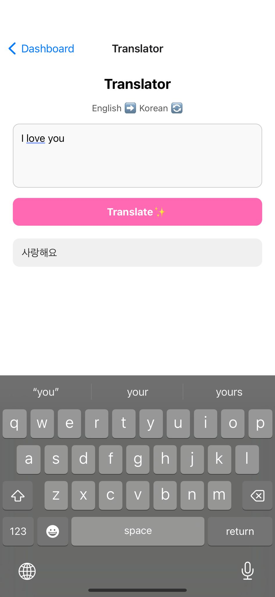

# 🌸 Boyeong — Learn Korean through K-Dramas

*A Final Year Project by Paris Le*

Boyeong is an interactive Korean language learning app that helps users improve their vocabulary, comprehension, and pronunciation using short, real-life K-drama scenes. Designed with language immersion in mind, Boyeong makes studying feel fun, engaging, and culturally enriching.

## 📱 Features

🎬 Learn from K-Drama Clips
Watch short drama clips with subtitles, English translations, and romanisation. Words that show root form, meaning, and pronunciation. Save words to practice later and move to the next scene with one click.

💾 Save & Review Vocabulary
Words saved from drama scenes are automatically added to your Flashcard Practice and Quiz sections for long-term learning.

🧠 Flashcard Practice with Flip Interaction
Swipe through saved vocabulary cards. Tap to flip between Korean and English meanings, helping reinforce active recall. Supports spaced repetition.

🧩 Interactive Quizzes with Cat Feedback
Practice vocabulary through multiple modes: multiple choice, match pairs, sentence building, and more. Correct answers trigger a dancing cat GIF, while wrong answers show a crying cat for playful encouragement.

✍️ Hangul Writing Practice
Trace Korean consonants and vowels in a drawing canvas with guided stroke outlines. Supports both basic and complex Hangul characters.

💬 Phrase Library from K-Dramas
Learn common expressions and trendy phrases from your favorite Korean shows and translations.

🌐 Mockup Translation Tool
Type and translate between English and Korean using a built-in mockup feature — great for quick lookups and practice.

🐱 Gamified Dashboard with Cat Mascot & Quotes
Stay motivated with a dashboard featuring a dancing cat mascot and a daily K-drama quote with translation. 


## 📸 Screenshots

A visual preview of Boyeong’s core features and UI design:

---

### 🔐 Login / Sign-up Screen

Users can register or log in to access personalised progress tracking and saved vocabulary. 


---

### 🏠 Main Menu

A central navigation screen that gives users quick access to all learning features.
It also includes a logout option for users to securely sign out of their accounts.


---

### 🐱 Dashboard with Cat Animation & Daily Quotes

Features a motivational cat mascot that dances or reacts based on progress, along with a daily K-drama quote and its English translation to keep learners inspired.
The screen also includes a main menu navigation bar that allows users to access all other key features.


---

### 🎬 K-Drama Clip Learning Screen

Learn Korean through short K-drama video clips with interactive subtitles. Each clip includes:

Korean subtitles, English translation, and romanisation for easy understanding

A "Practice" button to store selected words directly to the Flashcard Practice screen

A “Next” button for continuous learning through fresh drama moments

This immersive method combines real cultural context with practical vocabulary learning.
 


---

### 🧠 Flashcard Practice Screen

A swipe-based flashcard system using spaced repetition to help users review and retain vocabulary.
Flashcards are automatically generated from words saved on the K-drama clip screen, creating a seamless learning experience.
When a user taps on a card, it flips to reveal the translation in English or Korean, depending on the front side. This promotes active recall and builds strong language memory over time.


---

### 🧩 Quiz Screen

Interactive quizzes designed to reinforce learning through multiple game modes: multiple choice, match pairs, sentence rebuilding, and more.
If a user selects the correct answer, a dancing cat GIF appears as positive reinforcement. If the answer is incorrect, a crying cat emoji appears to gently encourage improvement.


---

### ✍️ Hangul Practice Screen

Users can trace and practice Korean letters on a drawing pad, including both basic and complex characters. 


---

### 💬 Phrase Library Screen

Browse trendy Korean expressions and popular drama phrases and everyday daily phrases with English translation meanings. 


---

### 🌐 Translation Screen

A mockup translation feature that allows users to translate text between English and Korean, helping with everyday practice beyond drama clips. Designed for quick lookups and simple sentence building.



---


## ⚙️ Tech Stack

* **Frontend**: React Native (Expo)
* **Backend**: Firebase (Authentication, Firestore, Storage)
* **Speech Recognition**: Expo Speech, Web Speech API
* **Video Playback**: Expo AV
* **Drawing Canvas**: react-native-signature-canvas

## 📂 Project Structure

```bash
Boyeong/
├── assets/                # Video clips, images, and audio
├── components/            # Reusable UI components
├── screens/               # Main app screens (Learn, Practice, Dashboard, etc.)
├── services/              # Firebase setup and utility functions
├── utils/                 # Helper functions (e.g., saveWordToFirebase)
├── App.js                 # Entry point
```

## 🚀 Getting Started

To run the project locally:

```bash
git clone https://github.com/yourusername/boyeong.git
cd boyeong
npm install
npx expo start
```

Make sure to add your Firebase config in `/services/firebase.jsx`.

## 🛠️ Future Plans

* Add spaced repetition logic with custom learning intervals
* Integrate voice acting or tone correction feedback
* Publish to App Store / Play Store
* Add community features for user-shared phrases and scenes

## 🧑‍🎓 About the Creator

I’m Paris Le, a final-year Computer Science student at TU Dublin, passionate about Korean culture, language learning, and educational technology. Boyeong was inspired by my own journey studying abroad in Korea and my love for dramas as a learning tool.

Connect with me:
🌐 [linkedin](https://www.linkedin.com/in/paristrinhle/) | 📧 [parisletrinh@gmail.com](mailto:paristrinhle@gmail.com)
